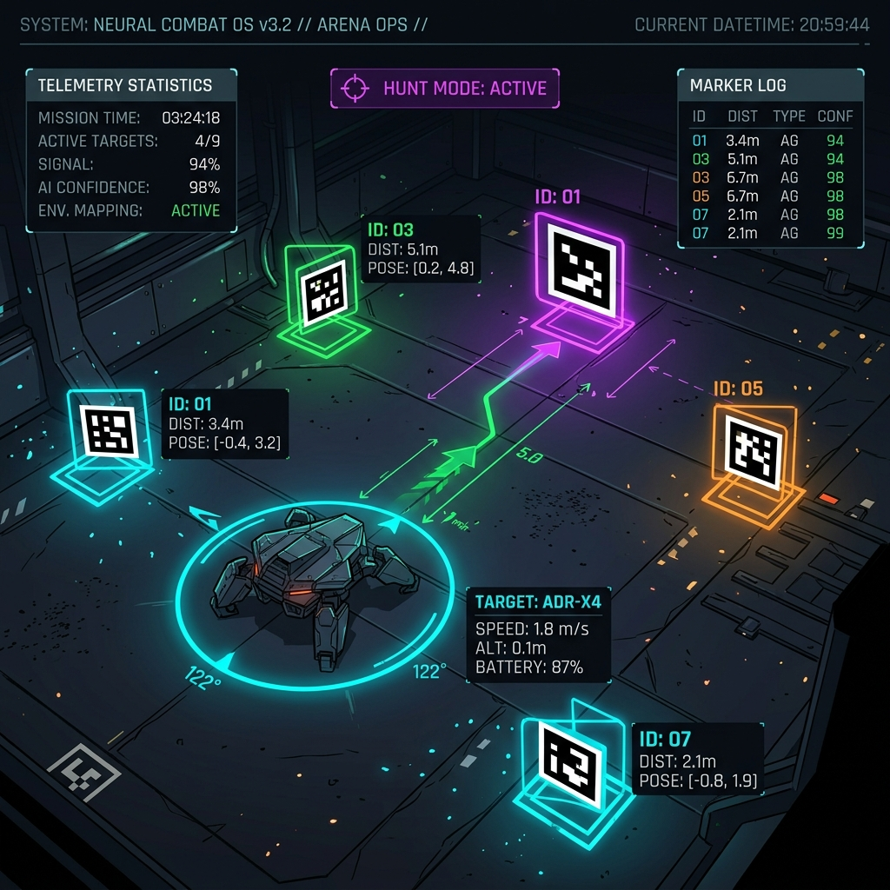
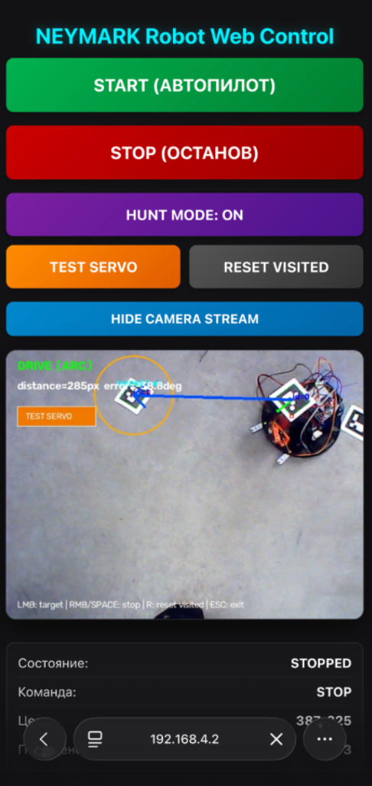

# ⚔️ Neymark2026_CV_BattleBot 🤖



**Умный боевой робот на базе компьютерного зрения (OpenCV), способный в реальном времени отслеживать ArUco-маркеры, плавно маневрировать по полю и охотиться на роботов-соперников.**

Проект включает в себя полноценную систему автономного управления (автопилот), неблокирующий привод оружия (сервопривод) и интерактивный веб-пульт управления для телефонов и ПК.

---

## 📸 Демонстрация работы

### Видеозапись тестов автопилота:


*Скриншот работы мобильного пульта управления во время прохождения трассы:*


---

## 🚀 Основные возможности

* **⚔️ Режим охоты (Hunt Mode):** Робот автоматически сканирует поле на наличие ArUco-маркеров врагов (`ENEMY_MARKER_IDS`). При обнаружении соперника он бросает мирное прохождение контрольных точек, разгоняется до максимальной скорости (`ATTACK_SPEED_MM_S = 400`) и идет на непрерывный таран, раскручивая оружие (ускоренное качание сервопривода).
* **🏎️ Плавное подруливание (P-регулятор угла):** Вместо резких разворотов на месте робот использует пропорциональный регулятор для плавного захода на виражи по дуге на полной скорости. Разворот на месте выполняется только при критических углах ($> 45^\circ$).
* **📱 Мобильный веб-интерфейс (Flask):** Легковесный пульт управления, доступный с любого устройства в сети (телефона/ПК). Позволяет:
  * Включать/выключать автопилот.
  * Активировать/деактивировать **Режим Охоты**.
  * Задавать цель вручную (кликом по кадру камеры).
  * Тестировать манипулятор/сервопривод.
  * Просматривать телеметрию (команда, координаты, посещенные точки) и опционально выводить видеопоток.
* **🎯 Автономный обход точек:** Робот находит ближайшие не посещенные маркеры и последовательно обходит их. При достижении цели он останавливается на 0.8 сек для быстрого сканирования оружия, а затем едет дальше.

---

## 🛠️ Технологический стек

* **Язык:** Python 3.9+
* **Компьютерное зрение:** OpenCV (модуль `aruco`)
* **Веб-сервер:** Flask + HTML5/CSS3 (с адаптивной темной темой под мобильные)
* **Сеть:** Мультипоточность (`threading`), TCP сокеты для управления контроллером робота.

---

## 📟 Прошивка ESP32-C3

В репозитории доступна финальная прошивка для модуля управления роботом в файле [esp32.ino](esp32.ino).
Прошивка решает следующие транспортные задачи:
* Создание Wi-Fi точки доступа (`NEYMARK_01` / `neymark123`).
* Поднятие DHCP-сервера с IP-адресом робота `192.168.4.1`.
* Запуск TCP-сервера на порту `8888` для приема управляющих команд от автопилота на Mac.
* Трансляция TCP-команд в аппаратный порт UART (скорость 38400 бод) для непосредственного исполнения на плате Arduino.
* Хостинг статусной веб-страницы на порту `80` для быстрой проверки подключения и статистики команд с телефона.

---

## 📟 Прошивка Arduino

В репозитории доступна финальная прошивка для основной управляющей платы робота в файле [ardu.ino](ardu.ino).
Arduino решает физические задачи движения и измерений:
* Подсчет тиков левого и правого энкодеров.
* Управление драйвером моторов с П-регулятором скорости для точной обработки заданных линейных и угловых скоростей.
* П-регулятор прямолинейного движения (автоматическая компенсация увода робота в сторону по разнице пройденного пути колес).
* Чтение показаний инфракрасного дальномера (Sharp) и фотодатчиков линии.
* Плавное позиционирование и неблокирующее отключение питания сервопривода оружия.
* Аппаратный таймер безопасности (Watchdog) — автоматический останов при потере команд от управляющего компьютера дольше 0.5 секунд.

---

## 🔌 Схема подключения и настройки

В файле `arucaupd.py` содержатся основные параметры, которые можно легко изменить:

* `CAMERA_INDEX = 0` — индекс используемой USB-камеры.
* `ROBOT_MARKER_ID = 0` — ID ArUco-маркера на вашем роботе (определяет его положение и направление).
* `ROBOT_ADDRESS = ("192.168.4.1", 8888)` — IP и порт Wi-Fi точки доступа ESP на роботе.
* `ENEMY_MARKER_IDS = {1, 2, 6, 7}` — ID ArUco-маркеров роботов-соперников для автоматического нападения.

---

## 📦 Быстрый запуск

1. **Клонируйте репозиторий:**
   ```bash
   git clone https://github.com/AnubisGmD/Neymark2026_CV_BattleBot.git
   cd Neymark2026_CV_BattleBot
   ```

2. **Установите зависимости:**
   ```bash
   pip install opencv-python numpy flask
   ```

3. **Подключитесь к Wi-Fi сети робота** (например, `NEYMARK_01`).

4. **Запустите программу:**
   ```bash
   python arucaupd.py
   ```

5. **Откройте веб-пульт:**
   В консоли отобразится IP-адрес вашего Mac. Откройте его в браузере телефона или ПК (например, `http://192.168.4.2:5001`).

---

## 🎮 Управление

### С телефона/ПК (через Web-интерфейс):
* **START (Автопилот):** Запустить автономный обход маркеров.
* **STOP (Останов):** Экстренно остановить робота.
* **HUNT MODE: ON/OFF:** Переключение режима охоты на врагов.
* **Test Servo / Reset Visited:** Тест манипулятора / сброс истории пройденных точек.
* **Show Camera Stream:** Включить живую трансляцию с камеры (рекомендуется выключать при слабом Wi-Fi сигнале ESP).

### С клавиатуры компьютера (в окне OpenCV):
* `SPACE` (Пробел) — Экстренный останов (STOP) и отключение автопилота.
* `R` / `r` — Сброс списка посещенных точек.
* `ESC` — Завершение работы программы.
* `Левый клик мыши` — Ручное указание целевой точки на экране.

---
Разработано для соревнований и тестов битв роботов! ⚔️🤖
